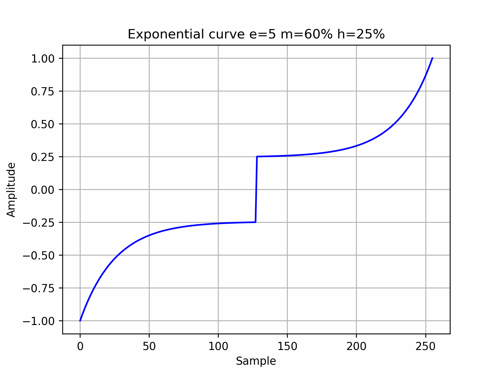
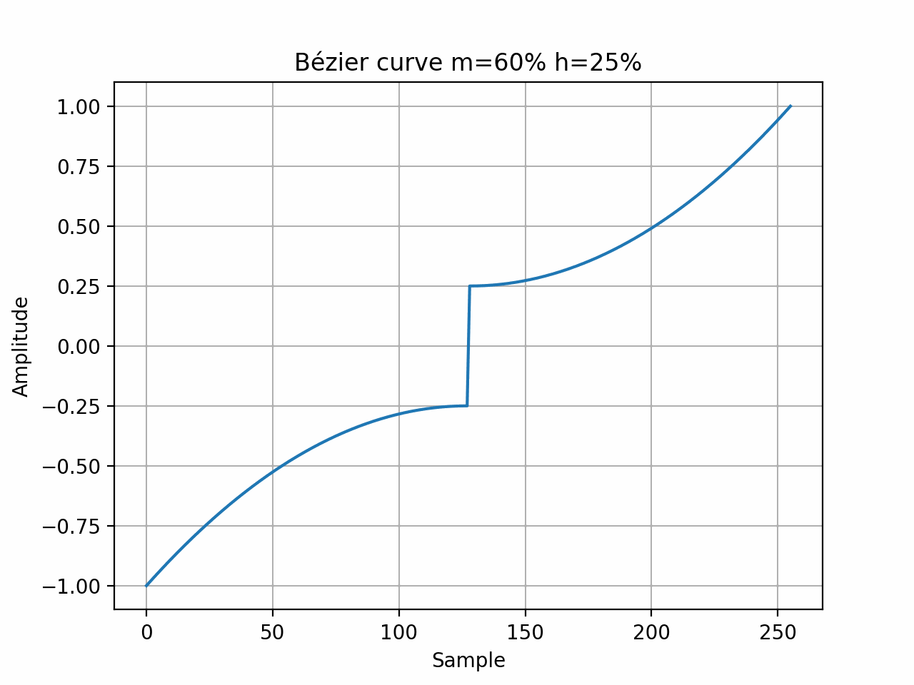

# wtcurve

Tool for generating morphing wavetables used in audio synthesis.

I have tested the 32-bit float WAV wavetables with the Linux versions of Surge XT, Bitwig Grid/Polymer, u-he Hive 2, and the Vital software synthesizers.

Currently, the tool supports the generation of a single waveform, which can be defined either as a modified exponential function or a Bezier curve. The function's plot is reflected on both the x and y axes, featuring a square central part. This waveform is commonly used in modern EDM/Psytrance bass sounds. The script also has the capability to generate graph or animated gif of the waveform. The waveform transformation occurs by adjusting the tilt of the center line from a vertical position to a customized angle, where the center line occupies the percentage of the total width specified by the `-m` option.

Exponential


Bézier


Bitwig 3D previews of wavetables that are generated using various parameters


Defaults: 32 bit float WAV, 256 waveforms, 2048 samples.

Requirements: python 3.x with numpy, matplotlib, soundfile.

Surely there are bugs here.

We have help:

```text
$ wtcurve --help

usage: wtcurve [-h] [-w NUM_WAVEFORMS] [-s {16,32,64,128,256,512,1024,2048,4096}] [--bits {16,32}] [-m MID_WIDTH_PCT] [-o MID_HOFFSET] [-e {2,3,4,5,6,7,8,9}]
               [-B] [--graph] [--wav] [--gif] [--dpi DPI] [-D]

options:
  -h, --help            show this help message and exit
  -w NUM_WAVEFORMS      Number of frames/waveforms (256)
  -s {16,32,64,128,256,512,1024,2048,4096}
                        Number of samples in one frame (2048)
  --bits {16,32}        Bits width (32)
  -m MID_WIDTH_PCT      Percents in middle part (None)
  -o MID_HOFFSET        Percents of middle horizontal offset from y=0 (None)
  -e {2,3,4,5,6,7,8,9}  Exponent of curve (5)
  -B                    Build Bezier curve instead of exponent
  --graph               Plot graph
  --wav                 Save wav
  --gif                 Save gif animation
  --dpi DPI             Graph/gif DPI (200)
  -D                    Debug
```

Try to play with `-m` from 20 to 50, `-o` from 20 to 70, `-e` with indicated range. Check the graph with `--graph`, it will show first and last frames.

# wttag

To ensure compatibility with most synthesizers, wavetables need to be tagged with the wttag script, using the same -w and -s values as specified for the wtcurve. This script adds a WAV chunk to the WAV file, indicating the number of waveforms or samples based on the chunk type. In most cases, using --clm should work fine. Please note that I am unable to test the output WAVs with Serum as I don't have access to it. Example:

```text
wttag -s 2048 -w 256 -i wtc_20m_20h_5e_2048s_256w_32b.wav -o wtv_clm.wav --clm
```

## to be continued

## (C)

All the aforementioned products are the property of their respective creators or owners.

## Warnings

Please make use of backups. While I have taken precautions to avoid overwriting or damaging any existing precious wavetables, unforeseen circumstances can occur. Use backups.
