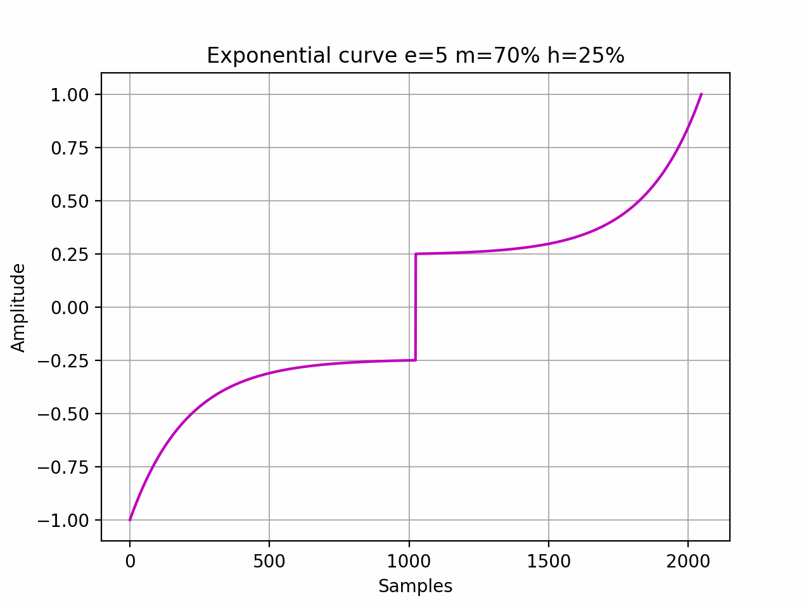
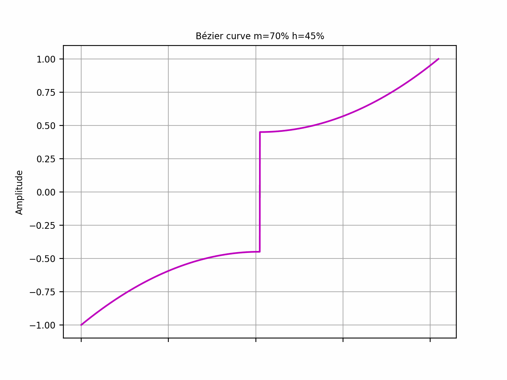
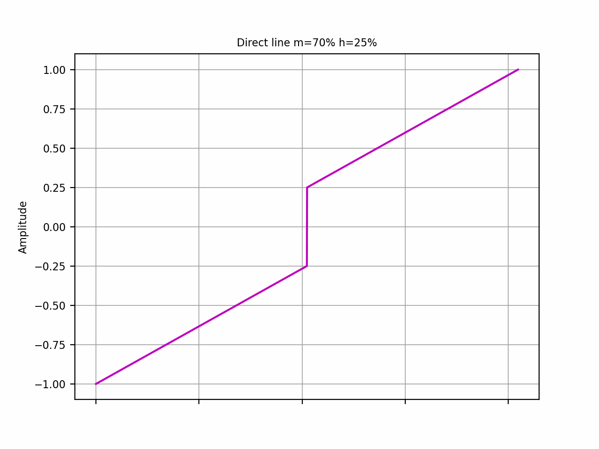
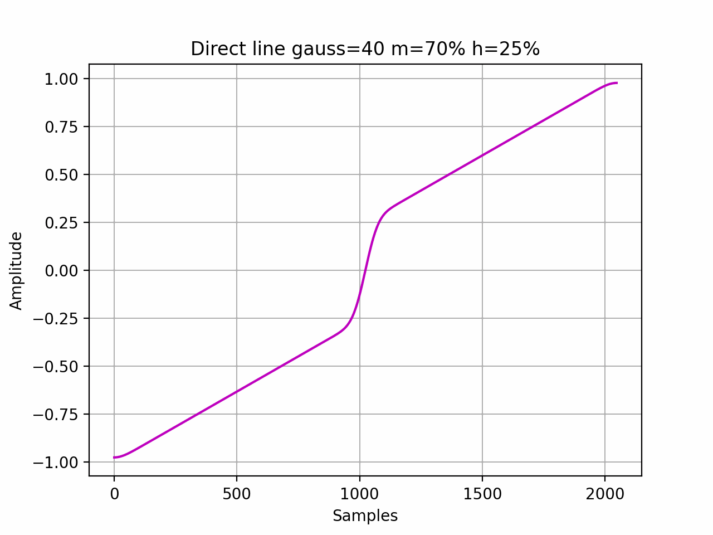
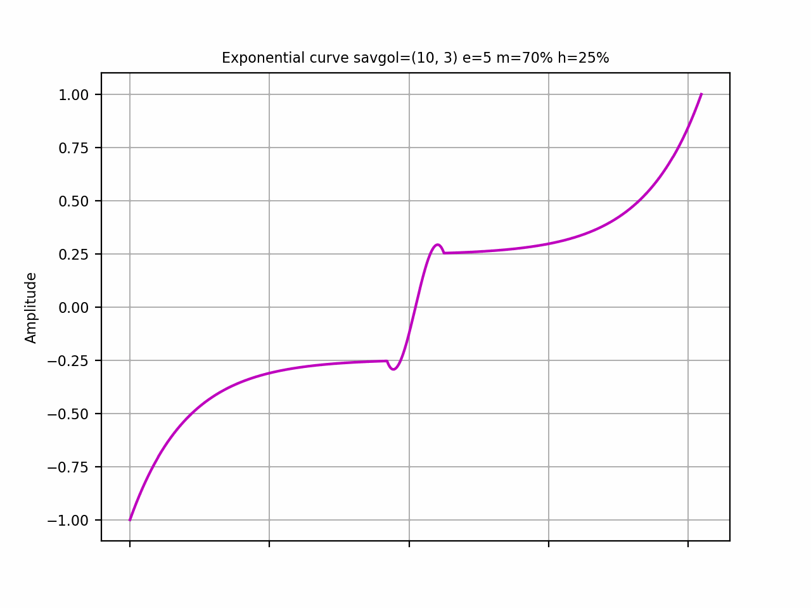
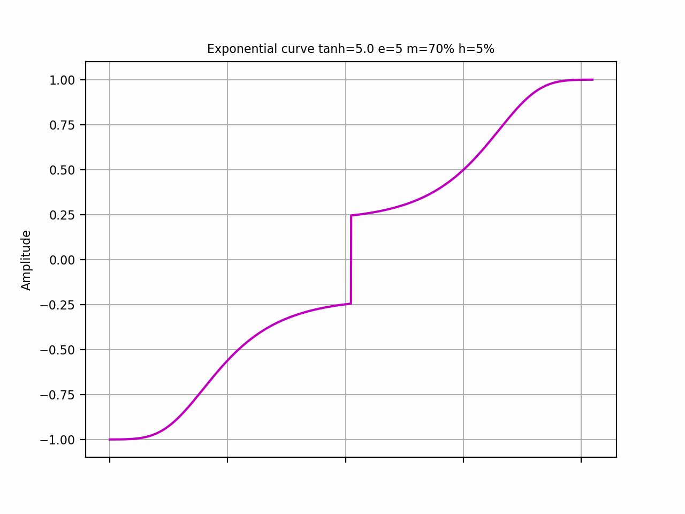
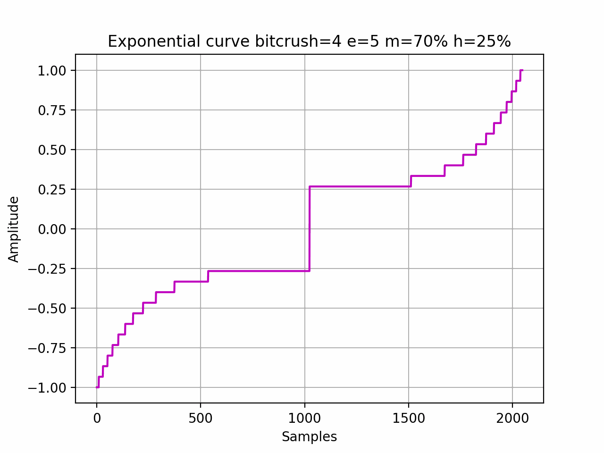
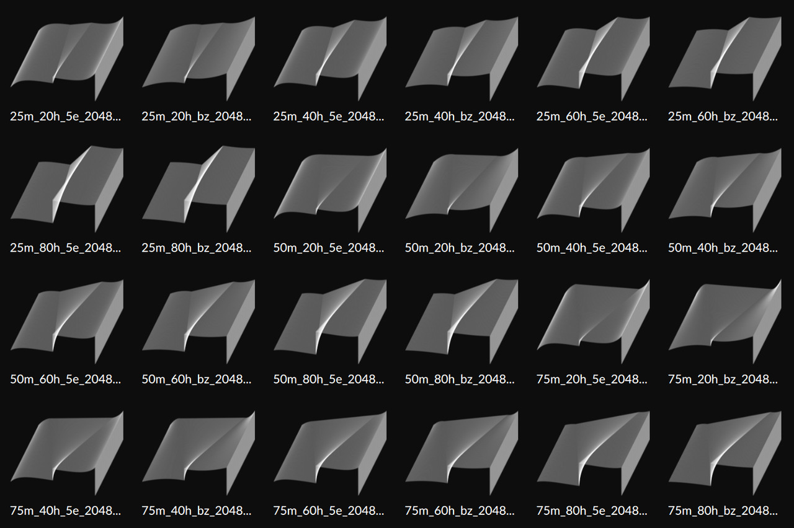
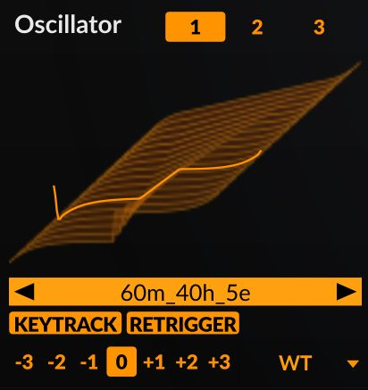

# Generate wavetables for audio synthesis

## wtcurve

wtcurve can generate symmetric waveforms using exponential function or bezier curve. The waveform has a linear central part, you can adjust the tilt of this part to custom angle using the `-m` option. The script can also plot the graph with first and last frame or save an animated gif of the waveform. By manipulating the parameters for Savitzky-Golay (`--savgol`) and Gaussian filters (`--gauss`), one can obtain a wide range of smoothed waveforms. Direct line (`-L`) instead of a curve allows the generation of diverse sawtooths.

I have tested the 32-bit float WAV wavetables with the Linux versions of [Surge XT](https://surge-synthesizer.github.io/), [Bitwig Studio Grid](https://www.bitwig.com/the-grid/), [u-he Hive 2](https://u-he.com/products/hive/), and the [Vital](https://vital.audio/) software synthesizers. For compatibility reasons, it is recommended to leave the default number of samples as 2048 (do not use `-s` flag). Only Surge XT is able to load tagged wavetables with arbitrary number of samples. 16-bit int and 32-bit float wt wavetables tested with Surge XT and Bitwig.

### Animations
















Defaults: 32 bit float WAV, 256 waveforms, 2048 samples.

Requirements: Python 3 with [NumPy](https://numpy.org/install/), [SciPy](https://scipy.org/), [Matplotlib](https://matplotlib.org), [soundfile](https://github.com/bastibe/python-soundfile).

Surely there are bugs here.

We have help:

```text
$ wtcurve --help

usage: wtcurve [-h] [-w NUM_WAVEFORMS] [-s {16,32,64,128,256,512,1024,2048,4096}] [--bits {16,32}] [-m MID_WIDTH_PCT] [-o MID_YOFFSET] [-e {2,3,4,5,6,7,8,9}] [-B] [-L] [--savgol SAVGOL]
               [--gauss GAUSS] [--graph] [--wav] [--wt] [--h2p] [--gif] [--dpi DPI] [-O] [--fullfn] [-D]

options:
  -h, --help            show this help message and exit
  -w NUM_WAVEFORMS      Number of waveforms (256)
  -s {16,32,64,128,256,512,1024,2048,4096}
                        Number of samples in waveform (2048)
  --bits {16,32}        Bit width (32)
  -m MID_WIDTH_PCT      Middle part width in % (60)
  -o MID_YOFFSET        Offset from y-axis in % (25)
  -e {2,3,4,5,6,7,8,9}  Exponent of curve (5)
  -B                    Build Bezier curve instead of exponent
  -L                    Direct line instead of curve
  --savgol SAVGOL       Savitzky-Golay filter window_length,polyorder, e.g. '51,3'
  --gauss GAUSS         Gaussian filter, int sigma, e.g. 2
  --graph               Plot graph
  --wav                 Save wav
  --wt                  Save wt (Bitwig/Surge)
  --h2p                 Save Zebra OSC h2p
  --gif                 Save gif animation
  --dpi DPI             Graph/gif DPI (200)
  -O                    Open gif
  --fullfn              Add full info to file name
  -D                    Debug
```

Try to play with `-m` from 20 to 50, `-o` from 20 to 70, `-e` with indicated range. Check the graph with `--graph`, it will show first and last frames.

## wttag

To ensure compatibility with most synthesizers, wavetables need to be tagged with the wttag script, using the same -w and -s values as specified for the wtcurve. This script adds a WAV chunk to the WAV file, indicating the number of waveforms or samples based on the chunk type. In most cases, using --clm should work fine. Please note that I am unable to test the output WAVs with Serum as I don't have access to it. Example:

```text
wttag -s 2048 -w 256 -i wtc_20m_20h_5e_2048s_256w.wav -o wtv_clm.wav --clm
```

### Screenhots

Bitwig 3D previews of wavetables that are generated using various parameters



Hive 2 wavetable oscillator


Zebra 2 oscillator


Surge XT wavetable oscillator



## (C)

All the aforementioned products are the property of their respective creators or owners.

## Warnings

Please make use of backups. While I have taken precautions to avoid overwriting or damaging any existing precious wavetables, unforeseen circumstances can occur. Use backups.
