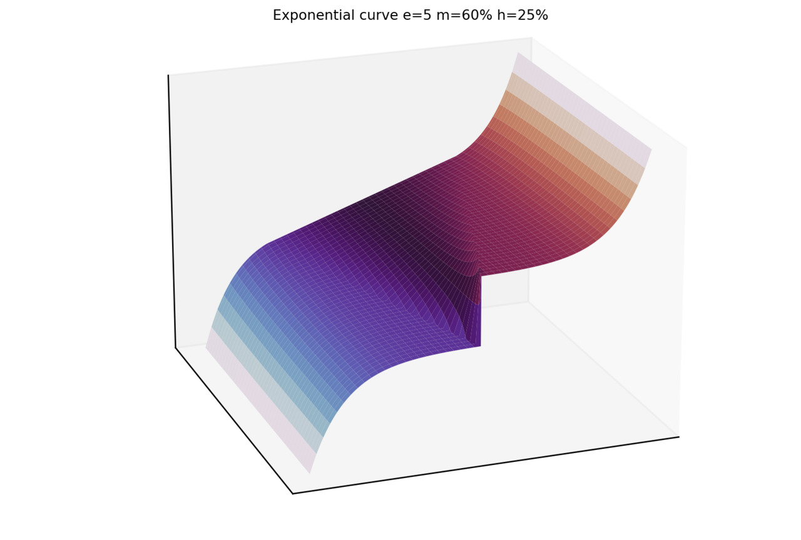
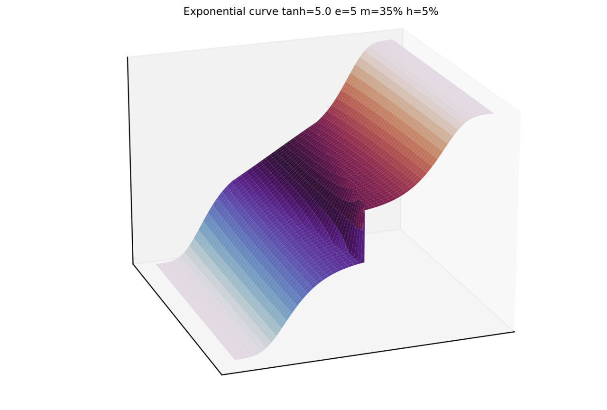
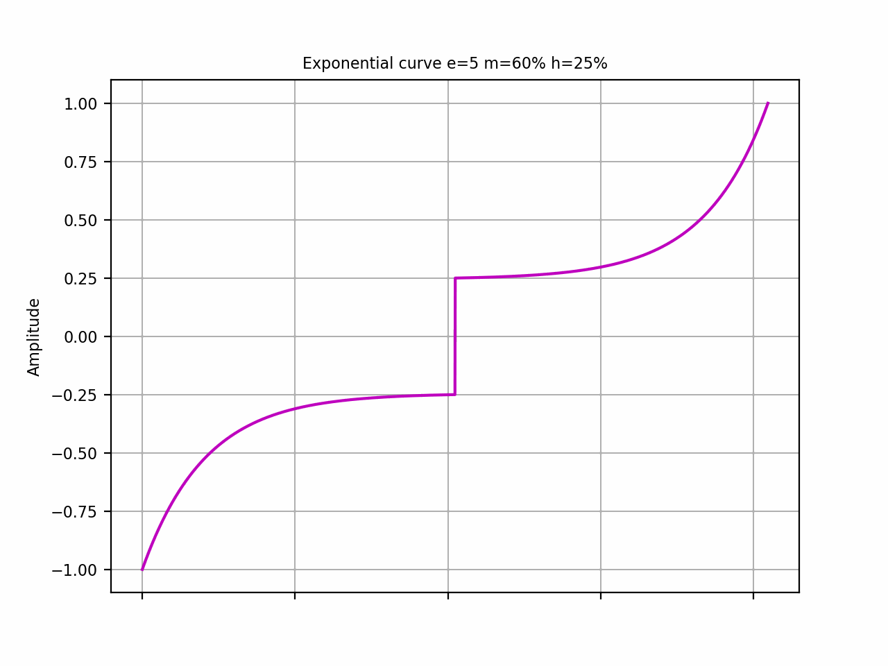
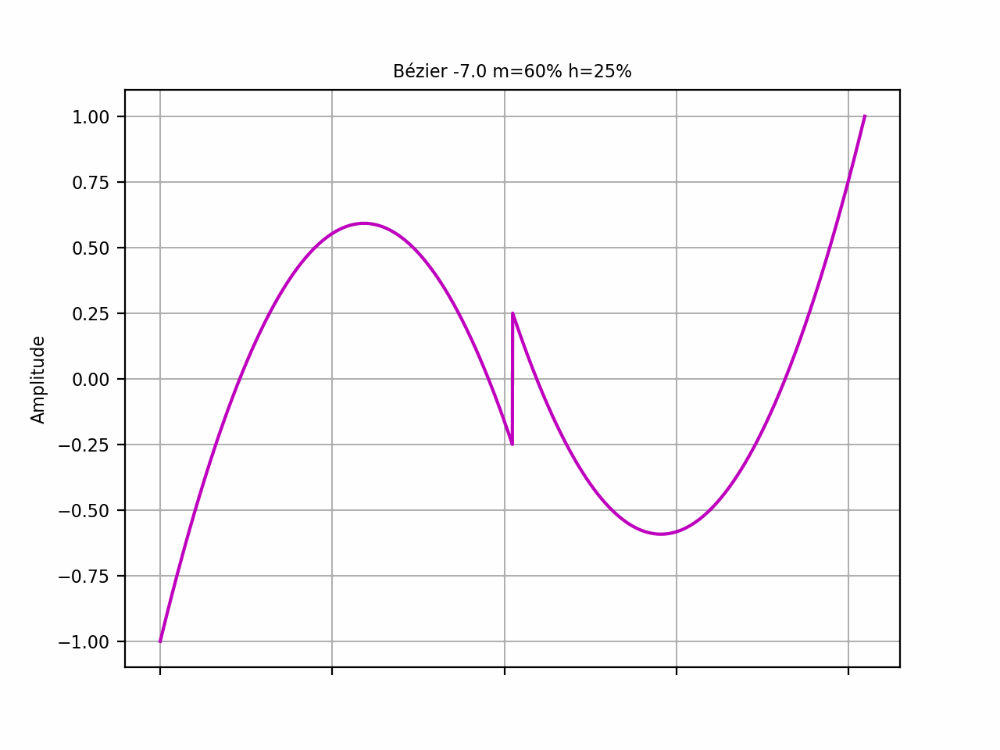
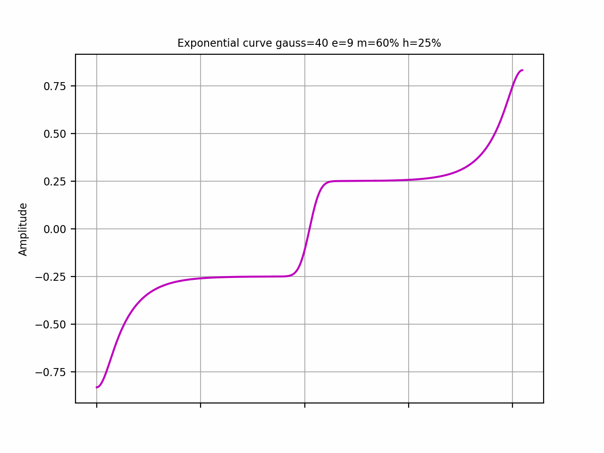
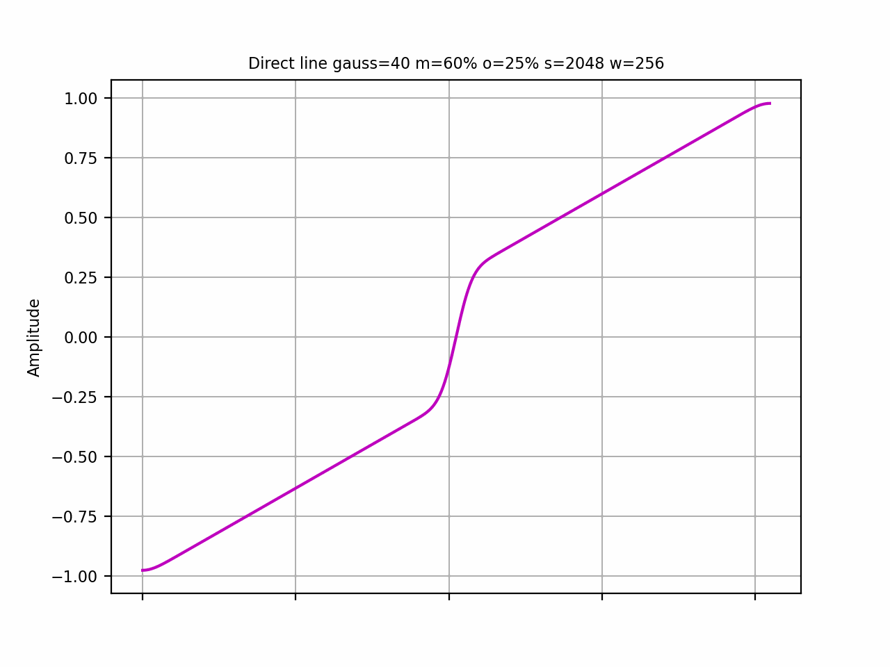
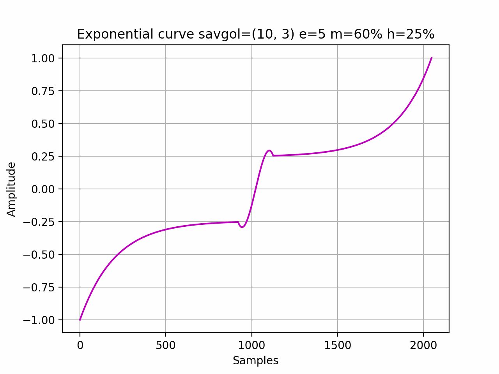
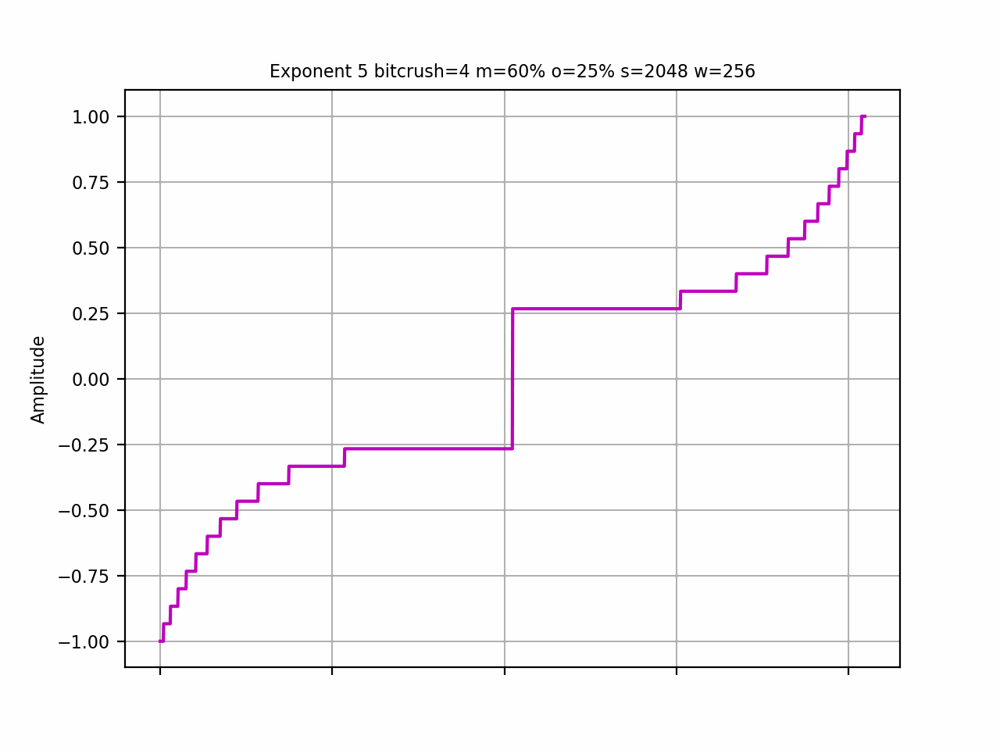
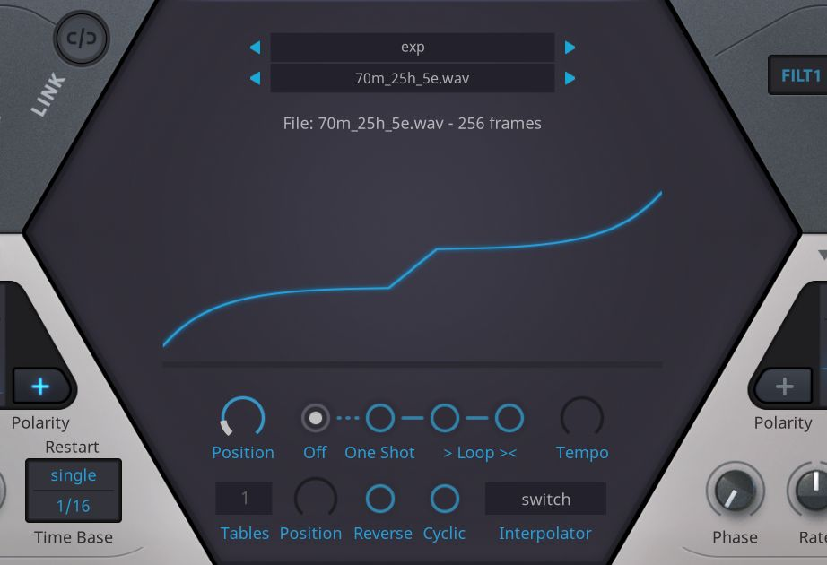

# Generate wavetables for audio synthesis

## wtcurve

wtcurve can generate symmetric waveforms using the exponential function or bezier curve. The waveform contains of a linear central part with adjustable width, which can be set in percentages using the `-m` option. The script can also plot the graph with the first and last frame, a 3D graph with the full wavetable, or an animated gif.

By manipulating parameters such as Savitzky-Golay `--savgol`, Gaussian filter `--gauss`, bitcrush `--bitcrush`, hyperbolic tangent `--tanh`, and direct line `-L`, a wide range of waveforms can be achieved. Applying Bezier `-B` will distort and clip the waveform when values fall outside the range of -9 to 4. The intentional omission of the range check provides greater freedom for experimentation. However, it's important to note that many combinations of argument values may result in an invalid waveform.

I have tested the 32-bit float WAV wavetables with the Linux versions of [Surge XT](https://surge-synthesizer.github.io/), [Bitwig Studio Grid](https://www.bitwig.com/the-grid/), [u-he Hive 2](https://u-he.com/products/hive/), and the [Vital](https://vital.audio/) software synthesizers. For compatibility reasons, it is recommended to leave the default number of samples as 2048 (do not use `-s` flag). Only Surge XT is able to load tagged wavetables with arbitrary number of samples. 16-bit int and 32-bit float wt wavetables tested with Surge XT and Bitwig.

### Visuals


















Defaults: 32 bit float WAV, 256 waveforms, 2048 samples.

Requirements: Python 3 with [NumPy](https://numpy.org/install/), [SciPy](https://scipy.org/), [Matplotlib](https://matplotlib.org), [soundfile](https://github.com/bastibe/python-soundfile). `wavchunks.py` scanner requires ancient [hexdump](https://pypi.org/project/hexdump/).

Surely there are bugs here.

We have help:

```text
$ wtcurve --help

usage: wtcurve [-h] [-D] [-w NUM_WAVEFORMS]
               [-s {16,32,64,128,256,512,1024,2048,4096}] [--16]
               [-m MID_WIDTH_PCT] [-o MID_YOFFSET] [-e {2,3,4,5,6,7,8,9}]
               [-B BEZIER] [-L] [--savgol SAVGOL] [--gauss GAUSS]
               [--bitcrush BITCRUSH] [--tanh TANH] [--dco] [--graph]
               [--graph3d] [--png] [--wav] [--wt] [--h2p] [--gif] [--dpi DPI]
               [--fontsize FONTSIZE] [-O] [--fullfn]

options:
  -h, --help            show this help message and exit
  -D                    Print a lot of debug messages

Waveform options:
  -w NUM_WAVEFORMS      Number of waveforms (default: 256)
  -s {16,32,64,128,256,512,1024,2048,4096}
                        Number of samples in waveform (default: 2048)
  --16                  Make 16-bit wavetable (default: 32)
  -m MID_WIDTH_PCT      Middle part width in % (default: 60)
  -o MID_YOFFSET        Offset from y-axis in % (default: 25)
  -e {2,3,4,5,6,7,8,9}  Exponent of curve (default: 5)
  -B BEZIER             Bezier control points float multiplier, best -9.0 to
                        4.0
  -L                    Use direct line instead of curve

Filter options:
  --savgol SAVGOL       Savitzky-Golay filter window_length_pct(%),polyorder,
                        e.g. '51,3'
  --gauss GAUSS         Gaussian filter int sigma, e.g. 2
  --bitcrush BITCRUSH   Bitcrush int depth, e.g. 5
  --tanh TANH           Hyperbolic float tangent, e.g. 4.0
  --dco                 Apply DC offset WIP!

Output options:
  --graph               Plot graph
  --graph3d             Plot 3D graph
  --png                 Save graph to png file
  --wav                 Save wav
  --wt                  Save wt (Bitwig/Surge)
  --h2p                 Save Zebra 2 OSC h2p, forced 128 samples / 16
                        waveforms
  --gif                 Save gif animation
  --dpi DPI             Graph/gif DPI (default: 200)
  --fontsize FONTSIZE   Graph/gif fontsize (default: 8)
  -O                    Open gif
  --fullfn              Add full info to file name
```

## wttag

To ensure compatibility with most synthesizers, wavetables need to be tagged with the wttag script, using the same -w and -s values as specified for the wtcurve. This script adds a WAV chunk to the WAV file, indicating the number of waveforms or samples based on the chunk type. In most cases, using --clm should work fine. Please note that I am unable to test the output WAVs with Serum as I don't have access to it. Example:

```text
wttag -s 2048 -w 256 -i 60m_25h_5e_2048s_256w.wav -o 60m_25h_5e.wav --clm
```

### Screenshots

Hive 2 wavetable oscillator



Zebra 2 oscillator


## (C)

All the aforementioned products are the property of their respective creators or owners.

## Warnings

Please make use of backups. While I have taken precautions to avoid overwriting or damaging any existing precious wavetables, unforeseen circumstances can occur. Use backups.
