# Generate wavetables for audio synthesis

## wtcurve

wtcurve can generate symmetric waveforms using the exponential function by default, hyperbolic tangent `--tanh` or bezier curve `-B`. The waveform consists of a linear central part with adjustable width, which can be set in percentages using the `-m` option. The script can also plot the graph with the first and last frame, 3D graph with the full wavetable or animated gif.

By manipulating parameters such as Savitzky-Golay `--savgol`, Gaussian filter `--gauss`, bitcrush `--bitcrush`  and direct line `-L`, a wide range of waveforms can be achieved. The `-o` option adjusts the offset of the start and end points of the middle section, shifting them along the y-axis (amplitude). Bezier will distort and clip the waveform when values fall outside the range of -9 to 4. Note that with `-o 0` the `-B` value has no effect at all: the control point height is the offset scaled by the multiplier, so a zero offset pins it to the axis no matter what `-B` says. The intentional omission of the range check provides greater freedom for experimentation. However, it's important to note that many combinations of argument values may result in an invalid waveform.

`gen_n_tag.py` is a sample script demonstrating how to programmatically generate multiple wavetables, note that destination paths are hard-coded.

I have tested the 32-bit float WAV wavetables with the Linux versions of [Surge XT](https://surge-synthesizer.github.io/), [Bitwig Studio Grid](https://www.bitwig.com/the-grid/), [u-he Hive 2](https://u-he.com/products/hive/), and the [Vital](https://vital.audio/) software synthesizers. For compatibility reasons, it is recommended to leave the default number of samples as 2048 (do not use `-s` flag). Only Surge XT is able to load tagged wavetables with arbitrary number of samples. 16-bit int and 32-bit float wt wavetables tested with Surge XT and Bitwig. The `--h2p` option saves a u-he Zebra 2 / ZebraHZ oscillator preset; this format is fixed at 16 waveforms of 128 samples, which are generated separately without affecting other outputs.

### Morphing sawtooth

The `--saw` option generates a morphing sawtooth instead of the curve waveform (`-m`, `-o` and the curve options are ignored, filters still apply). `--saw ramp` holds a plain sawtooth in every frame. It exists because every other family morphs by construction, which leaves nowhere to stand when the motion is meant to come from `--morph` alone: sweeping saturation over `--saw pow` sweeps the curvature too. `--saw harm` builds each frame additively from `1/k` harmonics, with the harmonic count growing geometrically from 1 (pure sine) to samples/4 (band-limited saw, 512 harmonics at default settings); sweeping the wavetable position sounds like opening a low-pass filter. `--saw skew` moves the ramp turnaround point across the cycle, morphing a reverse saw through a triangle into a saw. `--saw pow` and `--saw rc` morph the curvature of the ramp itself: both start from a perfectly linear saw and bend it more and more towards the last waveform. `pow` raises the normalized ramp to a power growing from 1.0 to 4.0, giving a rounded bottom and a sharp top; `rc` follows the analog capacitor charging curve `1 - e^(-t/RC)` with the rate constant growing from 0 to 8, giving the mirrored shape - sharp bottom, rounded top.

Be warned that curvature on its own is close to inaudible as a morph. Bending a ramp leaves the discontinuity where the cycle wraps, that discontinuity is what produces the `1/n` harmonic series, and so the bend only re-weights the lowest harmonics: measured across the whole table the spectral centroid moves 0.03 of an octave for `pow` and 0.10 for `rc`, where `harm` moves it more than six. Raising the exponent does not rescue it - past about 8 the centroid turns back - and a concave ramp has the same spectrum as a convex one, which is why `pow` and `rc` sound like each other. Treat them as waveform shapes rather than sweeps, or give them a second axis with `--morph`, for example `--saw pow --morph harmonics,1,512,log`.

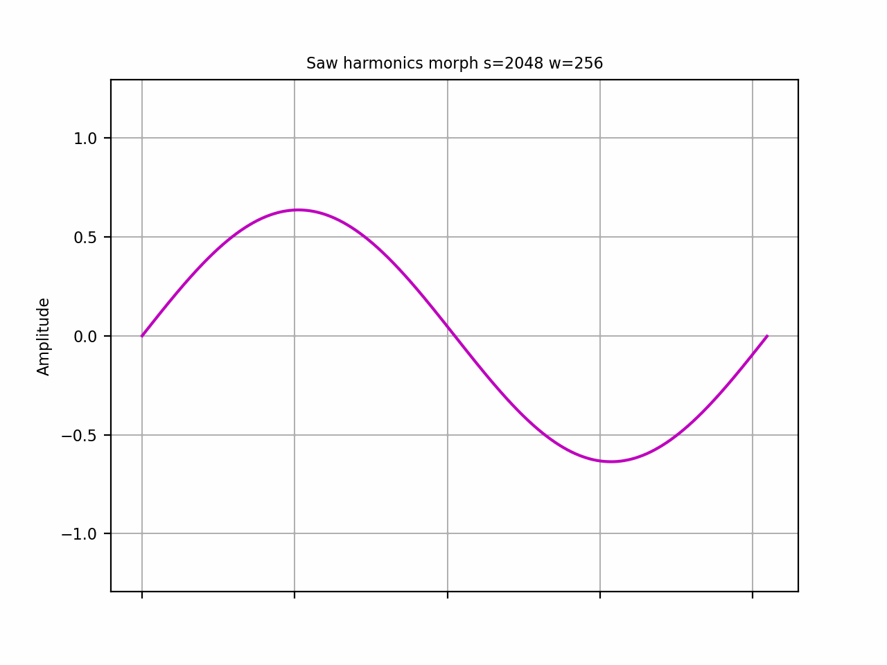

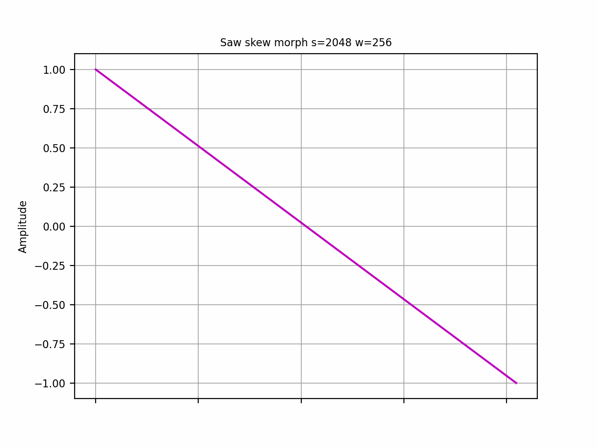

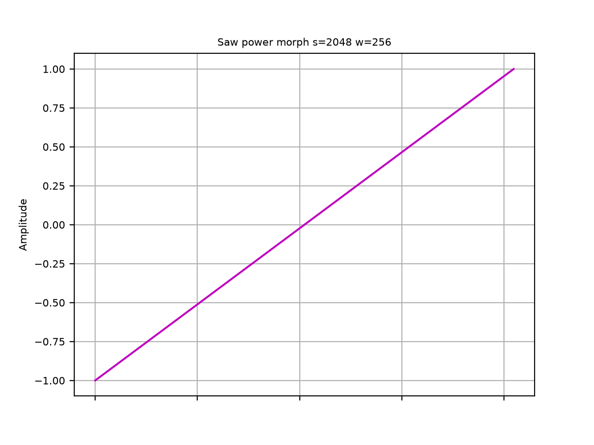

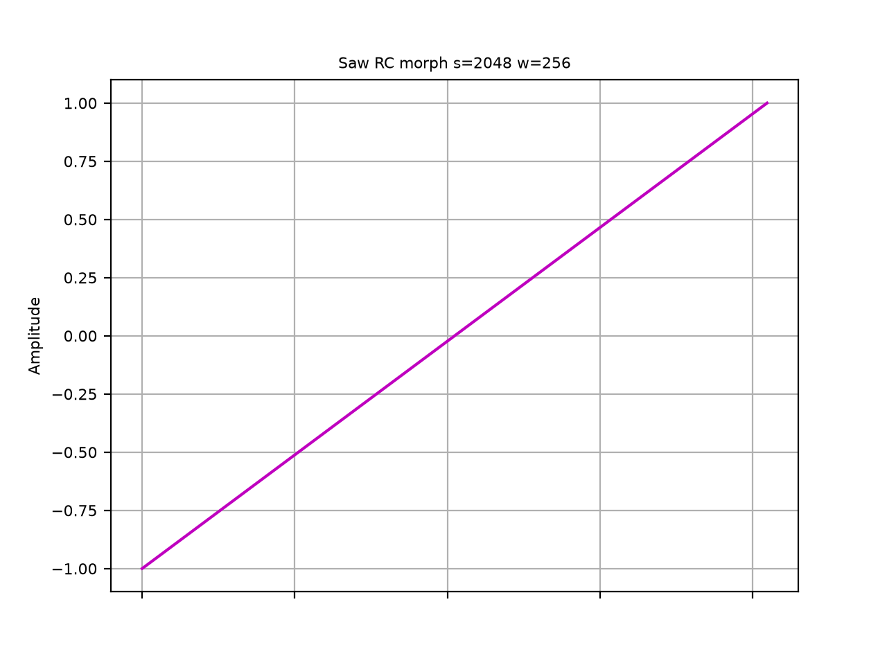

### Morphing any parameter

`--morph NAME,START,END[,lin|log]` sweeps a parameter across the wavetable instead of holding it at one value: `START` in the first waveform, `END` in the last. When that parameter carries a value - given explicitly, or by default as `-e`, `-m` and `-o` always are - and the value falls between the two ends, it lands in the **middle** waveform, so the table travels from one extreme through the waveform the rest of the command line describes to the other extreme. Without one the sweep is a plain line from start to end. Add `,log` for a geometric sweep, which is what a harmonic count, a filter width or any other ratio-like quantity wants - a linear sweep of `1..512` harmonics spends most of the table above harmonic 250 and sounds like it. Like the Bézier multiplier, morph ranges are deliberately unchecked: extremes are allowed to distort, and an exponent swept past about ±700 overflows into NaN frames.

The flag is repeatable, so several parameters can move at once, and it accepts the same names the flags use: `e`, `B`, `tanh`, `m`, `o`, `gauss`, `bitcrush`, `harmonics`, `neg`, `sat`, `satbias`, `fold`, `foldbias`.

Several of those parameters exist mainly to be morphed:

`--harmonics N` band-limits every waveform to the first `N` harmonics; `0` keeps nothing but DC, i.e. silence. Applied to a fixed waveform it is a low-pass; swept, it is the brightness axis that curvature morphs lack, and it can be laid over any of them: `--saw pow --harmonics 32 --morph harmonics,1,512,log` keeps the bent shape in every frame while the table opens from a sine to the full saw, with the 32-harmonic version in the middle.

`--sat DRIVE` and `--satbias BIAS` drive the waveform through `tanh(DRIVE * y + BIAS)` and re-centre it. The bias is the half that matters: without it the curve is symmetric and the result is only a quieter waveform, while with it one half of the waveform compresses and the other does not, which is what an analog oscillator's buffer stage does to a ramp. `--saw ramp --sat 1.257 --satbias 0.625` reproduces a captured hardware saw to a correlation of 0.9935 and a spectral error of 0.62 dB over 64 harmonics, against 1.81 dB for an ideal saw. Both are morphable, but note that a saw driven hard enough becomes a square - at `--sat 8` the waveform correlates 0.96 with one - so sweep the bias, or sweep `--harmonics` and leave the drive where it sounds right.

`--fold GAIN` and `--foldbias BIAS` run the waveform through a triangle wavefolder, the west coast timbre control: the input is scaled, offset and reflected back at every crossing of full scale. Its natural carrier is `--sine`, which holds a pure sine in every frame - a second still carrier next to `--saw ramp`. Sweeping the gain pours harmonics in the characteristic non-monotonic way, partials rising and falling as each fold passes through: `--sine --fold 3 --morph fold,1,6` moves the spectral centroid 4.2 octaves, where the curvature morphs manage 0.1 or less. It also drifts 3.7 dB of RMS, so pair it with `--rms`. The bias is the asymmetry axis: at `--fold 3` a bias of 0.5 takes the even-to-odd ratio from 0.00 to 0.73, and like the other shapers the DC it creates is removed and the peak restored.

`--neg X` scales the negative half of the waveform, the asymmetry a hardware oscillator has. On a symmetric waveform this manufactures even harmonics out of nothing - a sine at `--neg 0` measures an even-to-odd ratio of 0.64, against 0.00 untouched - so `--tanh 4 --morph neg,1,0.3` travels from a symmetric waveform to a lopsided one. On a sawtooth it does much less, because a saw already carries a full even series. Cutting one half also creates a DC offset, which no wavetable may carry, so the offset is removed and the peak restored afterwards.

`--rms` normalizes every waveform to the same RMS instead of leaving each at its own level, so that sweeping the wavetable position changes timbre and nothing else. Without it the position knob is part volume control: a sine and a saw of the same peak differ by 2.8 dB of RMS, and the tables measured here drift 2.2 dB across `--saw harm`, 3.8 dB across a saturation-bias morph, 4.6 dB across an exponent morph and 7.3 dB across `--saw rc` - loud enough to hear as a fade over the timbre. The table is peak-normalized as a whole afterwards, so nothing clips and no level argument is needed; the cost is headroom, since every frame but the loudest now sits below full scale (mean peak 0.73 to 0.93 on those same tables). It cannot be combined with `--norm`, which equalizes peaks and is the normalization that causes the drift.

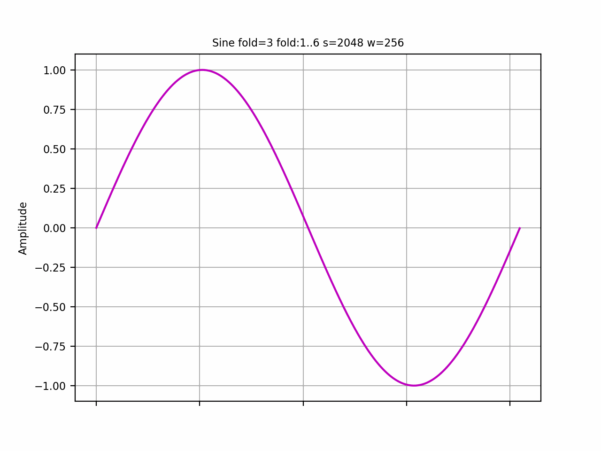

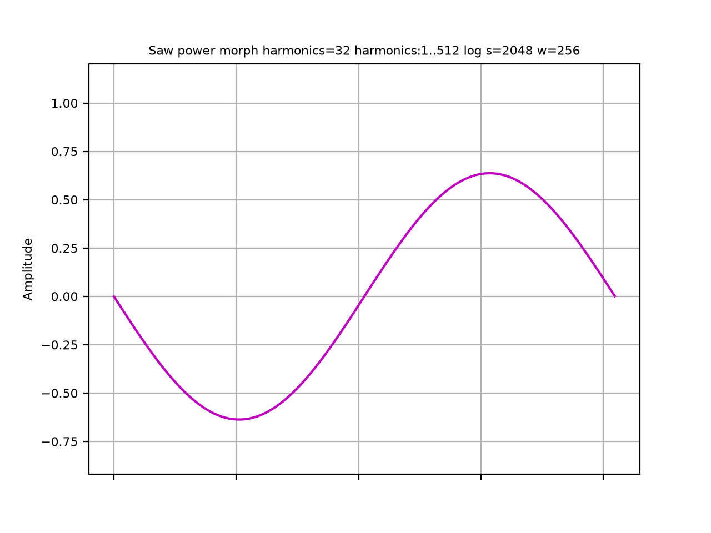

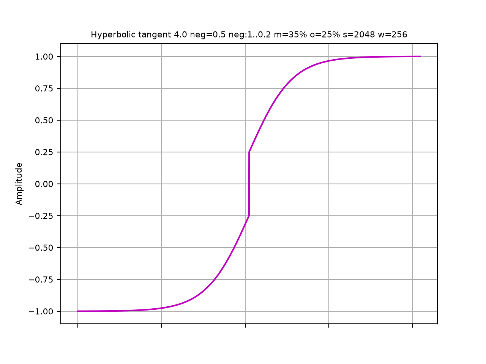

### File names

Output file names encode the parameters: `90m_25h_5e.wav` means middle part width 90% (`-m`), y-offset 25% (`-o`), exponential curve with exponent 5 (`-e`); `F4ht` is tanh 4.0, `F-7bz` is Bezier -7.0, `dl` is direct line. Filter and transform suffixes: `_sg` savgol, `_ga` gauss, `_bc` bitcrush, `_rev` reverse, `_sh` shift, `_no` normalize, `_rms` equal-RMS normalize, `_hm` harmonics, `_ng` neg, `_st` sat, `_sb` satbias, `_fd` fold, `_fb` foldbias. A morphed parameter appends `_mo` with its name and range, e.g. `_moharmonics1-512log`. With `--fullfn`, samples and waveforms counts are appended, e.g. `_2048s_256w`.

### Visuals

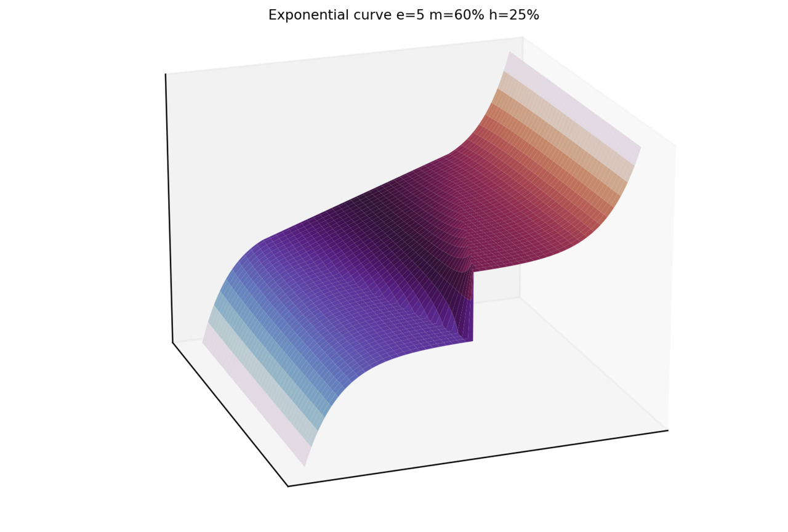

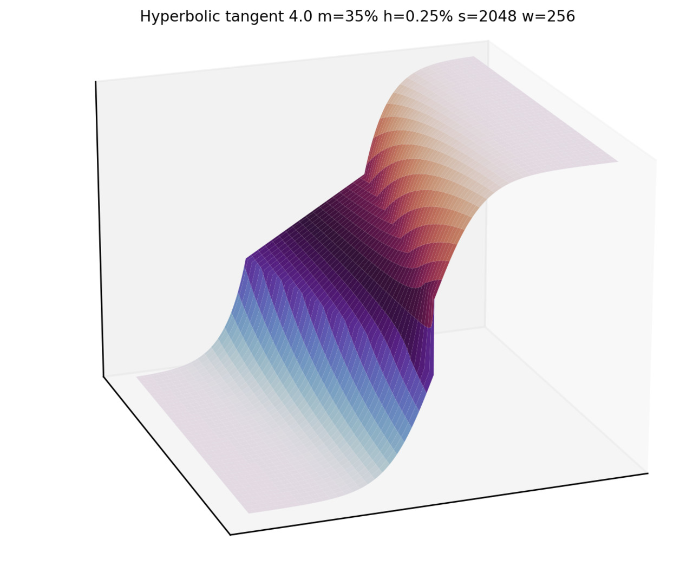

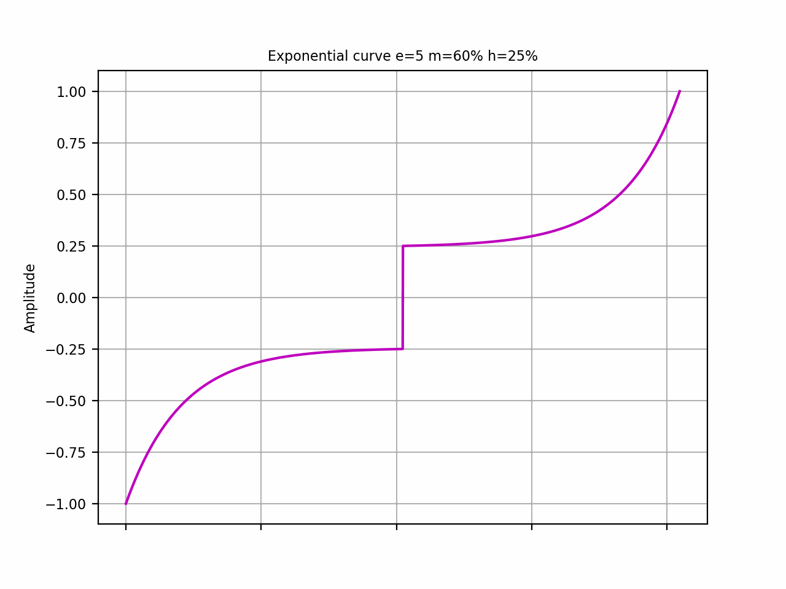

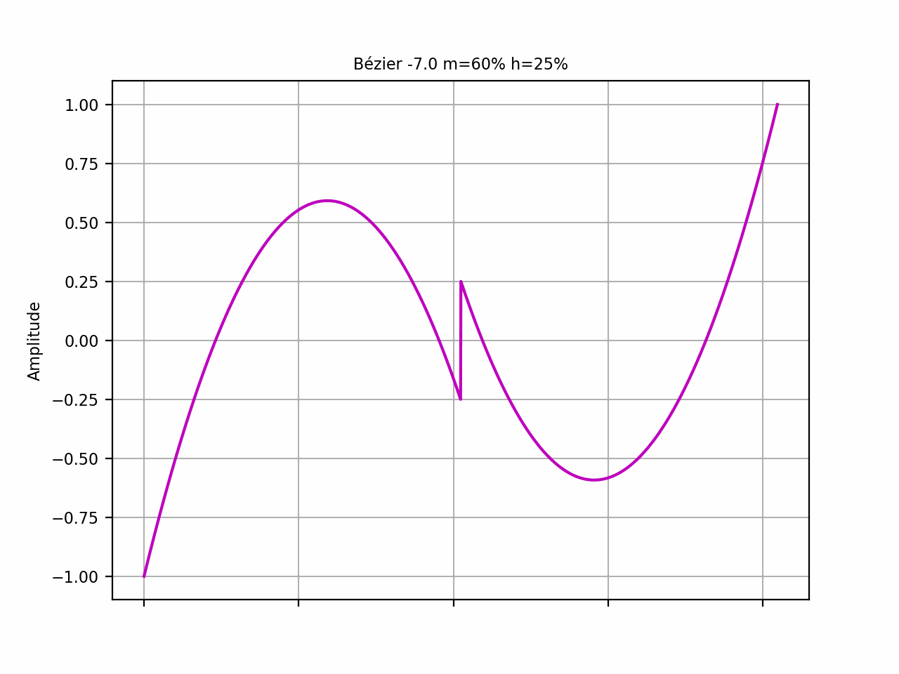

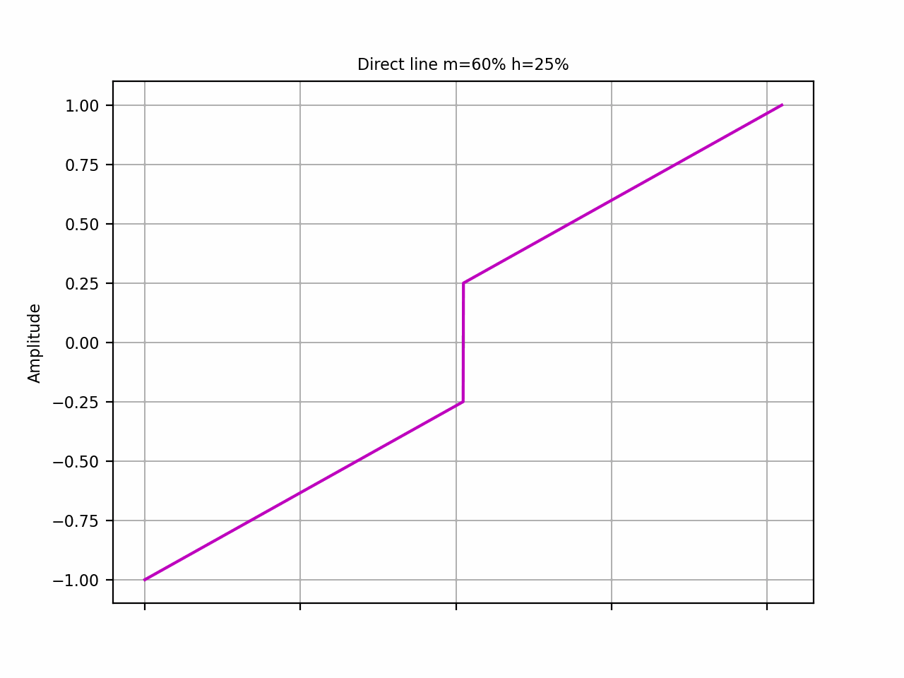

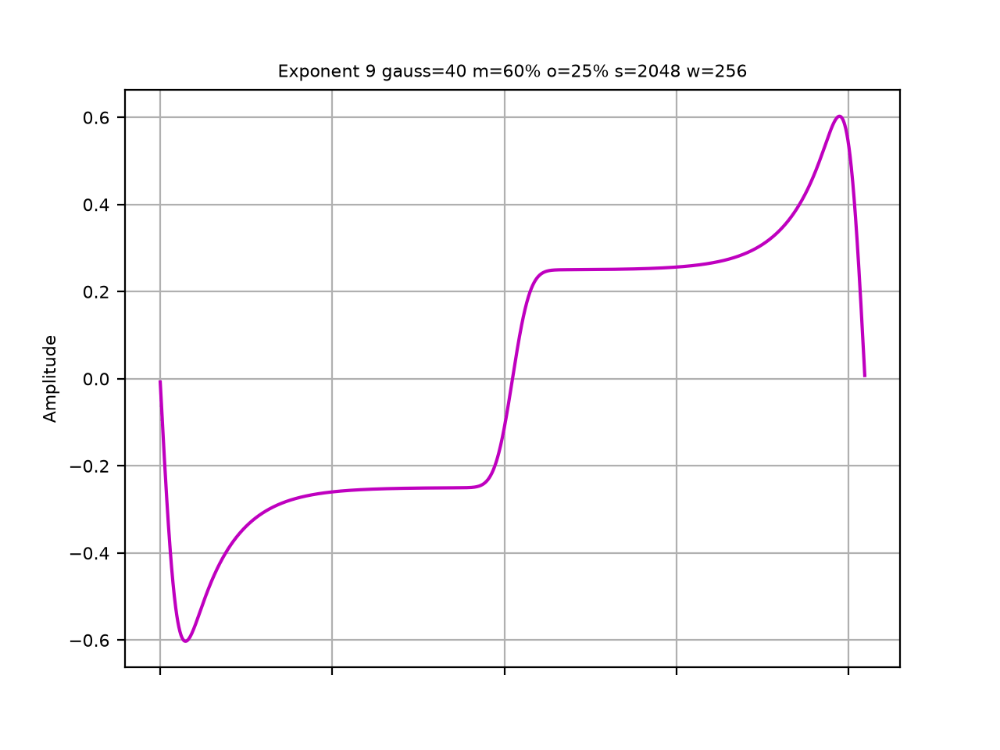

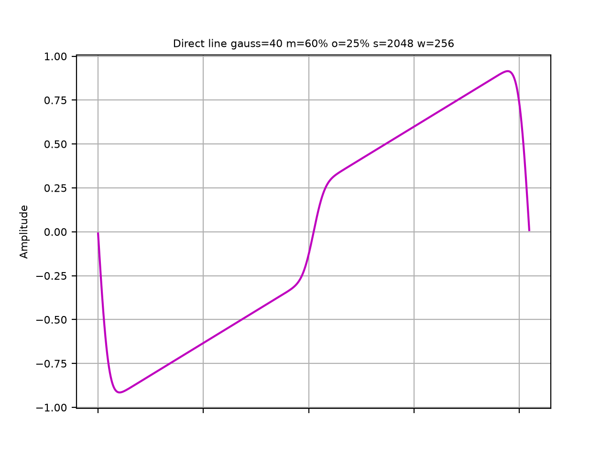

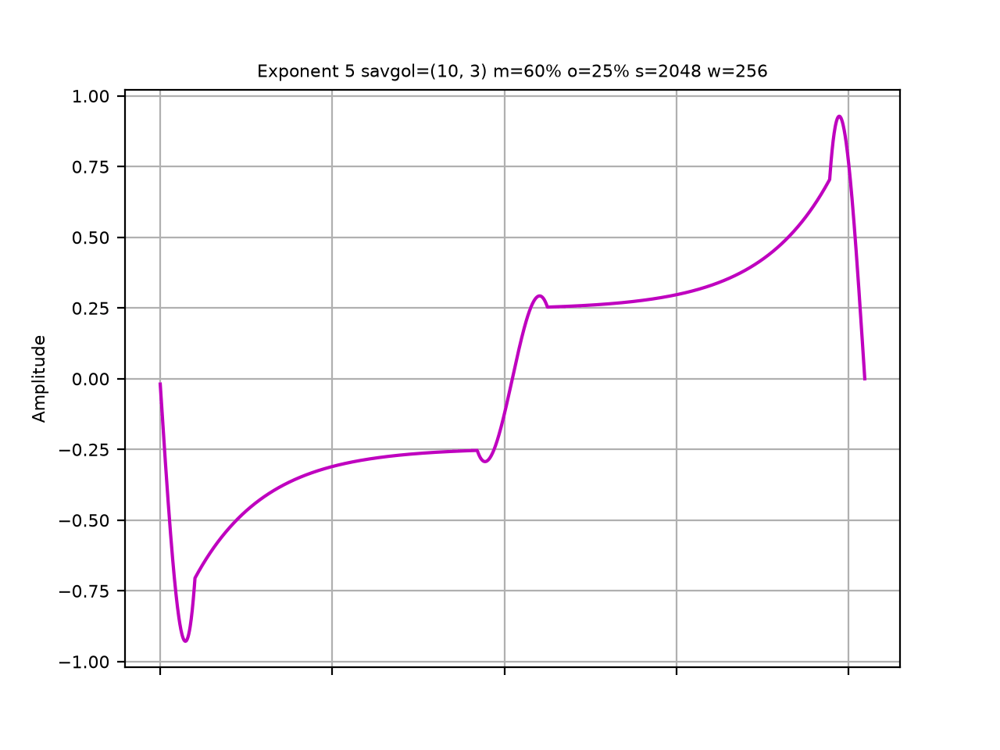

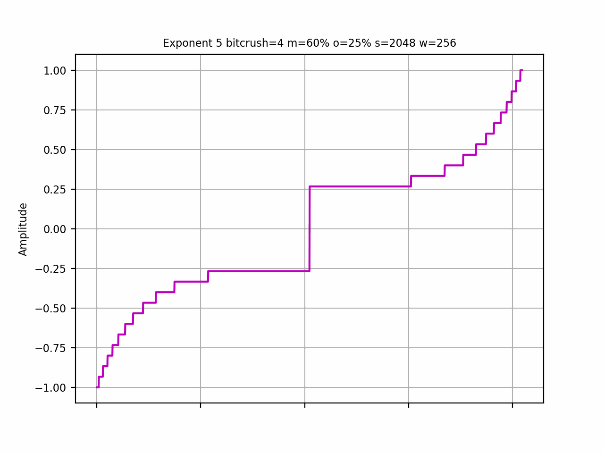

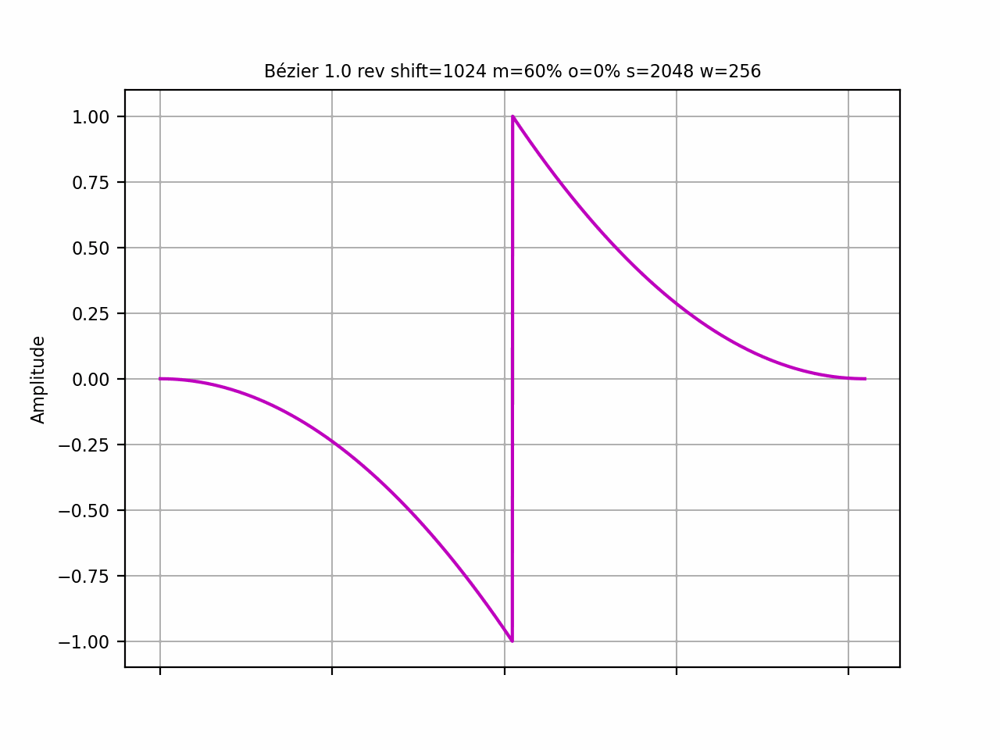

Defaults: 32 bit float WAV, 256 waveforms, 2048 samples.

Requirements: Python 3 with [NumPy](https://numpy.org/install/), [SciPy](https://scipy.org/), [Matplotlib](https://matplotlib.org), [soundfile](https://github.com/bastibe/python-soundfile), installable with:

```text
pip install -r requirements.txt
```

Surely there are bugs here.

We have help:

```text
$ wtcurve.py --help

usage: wtcurve.py [-h] [-D] [-w NUM_WAVEFORMS]
                  [-s {16,32,64,128,256,512,1024,2048,4096}] [--16]
                  [-m MID_WIDTH_PCT] [-o MID_YOFFSET] [-e {2,3,4,5,6,7,8,9}]
                  [--tanh TANH] [-B BEZIER] [-L]
                  [--saw {ramp,harm,skew,pow,rc}] [--sine] [--fold FOLD]
                  [--foldbias FOLDBIAS] [--harmonics HARMONICS] [--neg NEG]
                  [--sat SAT] [--satbias SATBIAS]
                  [--morph NAME,START,END[,lin|log]] [--rev] [--shift SHIFT]
                  [--norm NORM] [--rms] [--savgol SAVGOL] [--gauss GAUSS]
                  [--bitcrush BITCRUSH] [--graph] [--graph3d] [--png] [--wav]
                  [--wt] [--h2p] [--gif] [--dpi DPI] [--fontsize FONTSIZE]
                  [-O] [--fullfn]

options:
  -h, --help            show this help message and exit
  -D                    Print a lot of debug messages

Waveform options:
  -w NUM_WAVEFORMS      Number of waveforms; 1 renders the last, fully morphed
                        frame (default: 256)
  -s {16,32,64,128,256,512,1024,2048,4096}
                        Number of samples in waveform (default: 2048)
  --16                  Make 16-bit wavetable (default: 32)
  -m MID_WIDTH_PCT      Middle part width in % (default: 90)
  -o MID_YOFFSET        Offset from y-axis in % (default: 25)
  -e {2,3,4,5,6,7,8,9}  Exponent of curve (default: 5)
  --tanh TANH           Hyperbolic float tangent, e.g. 4.0
  -B BEZIER             Bezier control point float multiplier, best -9.0..4.0
  -L                    Direct line instead of curve
  --saw {ramp,harm,skew,pow,rc}
                        Morphing sawtooth: ramp holds a plain saw in every
                        frame, for a table whose motion comes entirely from
                        --morph; harm morphs sine to saw by adding harmonics,
                        skew morphs reverse saw to saw through triangle, pow
                        and rc morph the ramp curvature from linear to power-
                        bent or RC capacitor charge shaped
  --sine                Sine in every frame, a still carrier like --saw ramp
                        whose motion comes from --morph alone; the carrier a
                        wavefolder wants
  --fold FOLD           Triangle-wavefold the waveform at this gain, e.g. 3;
                        sweeping it is the west coast timbre morph; zero or
                        less disables it, mid-morph frames included; morphable
  --foldbias FOLDBIAS   Offset fed into --fold, e.g. 0.5, which breaks the
                        fold symmetry and adds even harmonics; DC is removed
                        afterwards; morphable
  --harmonics HARMONICS
                        Band-limit every waveform to this many harmonics, e.g.
                        32; morphable
  --neg NEG             Scale the negative half of the waveform, e.g. 0.5 for
                        the asymmetry of a hardware oscillator; DC is removed
                        and the peak restored afterwards; morphable
  --sat SAT             Drive the waveform through tanh, e.g. 1.26; the
                        asymmetric soft clipping of an analog oscillator stage
                        when paired with --satbias; zero or less disables it,
                        mid-morph frames included; morphable
  --satbias SATBIAS     Offset fed into --sat, e.g. 0.63, which compresses one
                        half of the waveform more than the other; DC is
                        removed afterwards; morphable
  --morph NAME,START,END[,lin|log]
                        Sweep a parameter across the wavetable: START in the
                        first waveform, END in the last, and the value the
                        flag itself carries in the middle one. Add ,log for a
                        geometric sweep, which is what a harmonic count or any
                        other ratio-like quantity wants. Repeatable.
                        Morphable: e, B, tanh, m, o, gauss, bitcrush,
                        harmonics, neg, sat, satbias, fold, foldbias
  --rev                 Reverse waveform
  --shift SHIFT         Shift (roll) waveform, int samples
  --norm NORM           Normalize every waveform to this peak, float, e.g. 0.8
  --rms                 Normalize every waveform to the same RMS, so that
                        sweeping the wavetable position changes timbre and not
                        loudness; the table is peak-normalized as a whole
                        afterwards. Not usable with --norm, which equalizes
                        peaks instead and is what causes the drift.

Filter options:
  --savgol SAVGOL       Savitzky-Golay filter window_len(%),polyorder, e.g.
                        51,3
  --gauss GAUSS         Gaussian filter int sigma, e.g. 2
  --bitcrush BITCRUSH   Bitcrush int depth, e.g. 5

Output options:
  --graph               Plot graph
  --graph3d             Plot 3D graph
  --png                 Save graph to png file
  --wav                 Save wav
  --wt                  Save wt (Bitwig/Surge)
  --h2p                 Save Zebra 2 OSC h2p, forced 128 samples / 16
                        waveforms
  --gif                 Save gif animation
  --dpi DPI             Graph/gif DPI (default: 200)
  --fontsize FONTSIZE   Graph/gif fontsize (default: 8)
  -O                    Open gif
  --fullfn              Add full info to file name
```

## wttag

To ensure compatibility with most synthesizers, wavetables need to be tagged with the wttag script, using the same -w and -s values as specified for the wtcurve. This script adds a WAV chunk to the WAV file, indicating the number of waveforms or samples based on the chunk type. In most cases, using --clm should work fine. Please note that I am unable to test the output WAVs with Serum as I don't have access to it. Example:

```text
wttag.py -s 2048 -w 256 -i 90m_25h_5e_2048s_256w.wav -o 90m_25h_5e.wav --clm
```

```text
$ wttag.py --help

usage: wttag.py [-h] [-w NUM_WAVEFORMS] -s
                {8,16,32,64,128,256,512,1024,2048,4096} [--surge] [--uhe]
                [--clm] -i SRC_FILE -o DST_FILE [--of] [--ot] [-m] [-a]

options:
  -h, --help            show this help message and exit
  -w NUM_WAVEFORMS      Number of frames/waveforms
  -s {8,16,32,64,128,256,512,1024,2048,4096}
                        Number of samples in one frame
  --surge               Add Surge tag
  --uhe                 Add u-he (e.g. Hive) tag
  --clm                 Add clm (e.g. Serum) tag
  -i SRC_FILE           Source file
  -o DST_FILE           Output file
  --of                  Overwrite output file
  --ot                  Overwrite tags
  -m                    Make destination directories
  -a                    Do not skip extra tags
```

### Screenshots

Hive 2 wavetable oscillator

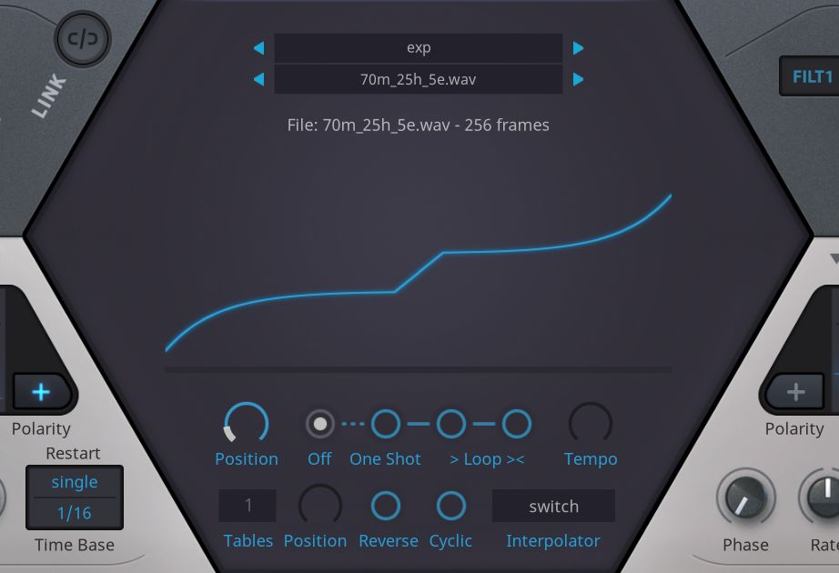

Vital oscillators

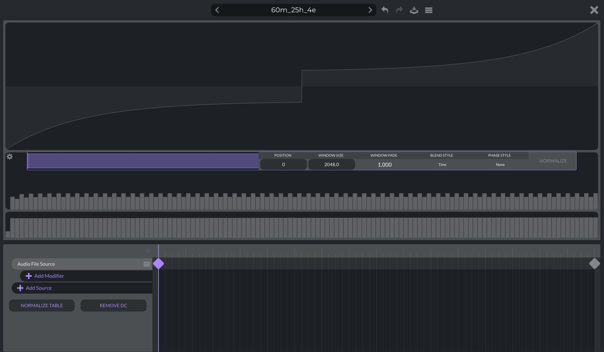

## wavchunks

`wavchunks.py` is an inspection tool: it dumps the RIFF chunks of WAV files (fmt, data, and wavetable tags like `clm `, `uhWT`, `srge`), prints the first sample values and tries to derive the waveforms/samples layout from the tags. Useful for examining both generated and third-party wavetables. It takes file or directory arguments:

```text
wavchunks.py 90m_25h_5e.wav
wavchunks.py ~/Music/Wavetables
```

## (C)

All the aforementioned products are the property of their respective creators or owners.

## Warnings

Please make use of backups. While I have taken precautions to avoid overwriting or damaging any existing precious wavetables, unforeseen circumstances can occur. Use backups.
